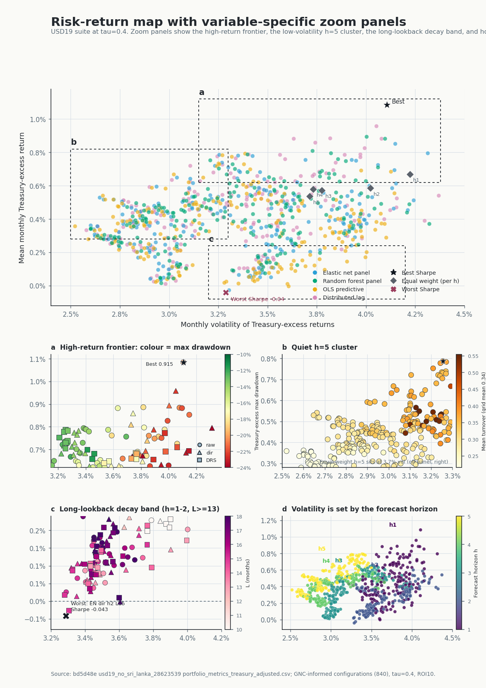

# Alternative Data Portfolio Optimization

Locked bachelor-thesis repository for reproducing the report evidence: Sentinel-2 port imagery, U-Net container segmentation, port/country GNC panels, return forecasts, MAD portfolios, tables, and final figures.

This is the clean repository. It intentionally contains only the final pipeline code, locked manifests, materialized final outputs, and report-facing plots. Historical/stale scripts from the working repo were not copied.



## What Is Locked

| Layer | Locked source | Local materialized path |
| --- | --- | --- |
| U-Net model package provenance | `cb031ac4deffdb3a91aabb4b5f61186ca9e3ab34` | `final_runs/full_gode_havnebilleder_tau06_final_2026_06_05/model/` |
| Supervised tau=0.4 metrics | `1b6c343467e7ea73e13554e65316a2fb3b642694` | `report_artifacts/supervised_tau04_checks_cb031ac_8a44dd0/` |
| Full inference and downstream results | `bd5d48e991e362f5114797622be8ca4b622ea0f2` | `final_runs/tau04_hk_28623539/` |

The short conflict rule is [SOURCE_OF_TRUTH.md](SOURCE_OF_TRUTH.md). The full runbook is [pipelines/FINAL_PIPELINE_TRACKER.md](pipelines/FINAL_PIPELINE_TRACKER.md).

## Headline Results

- Best GNC-informed MAD: `distributed_lag`, `h=1`, raw signal, `L=5`.
- Treasury-adjusted Sharpe: `0.915243`.
- Matched equal-weight Treasury Sharpe: `0.548530`.
- Historical-mean no-GNC baseline: `0.830063`.
- Always-positive baseline: `0.768995`.
- Full inference cases: `39,530` across `49` ports.
- Monthly GNC panels: `4,797` port-months and `2,323` country-months.

## Quick Start

Install Git LFS before cloning or pulling the large locked artifacts:

```bash
git lfs install
git clone https://github.com/AndersNBE/Alternative-data-portfolio-optimization-bachelor.git
cd Alternative-data-portfolio-optimization-bachelor
python3 -m venv .venv
source .venv/bin/activate
pip install -r requirements.txt
```

Validate the locked repository:

```bash
make lock
```

Generate the five final MAD `.tex` tables:

```bash
make tables
```

Regenerate report figures from the locked CSV/PNG bundles:

```bash
make figures
```

The qualitative panel generator additionally needs the frozen image/mask root:

```bash
FINAL_SEGMENTATION_IMAGE_ROOT=/path/to/Final_Segmentation_LA_Edit \
  MPLCONFIGDIR=/tmp/mpl-cache-codex XDG_CACHE_HOME=/tmp \
  python3 report_regen_2026-06-11/regen_panels_tau04.py
```

## Repository Map

- `pipelines/`: final runbook and audit manifests.
- `final_runs/`: materialized frozen model/downstream artifacts needed to validate the report evidence.
- `report_artifacts/`: materialized supervised segmentation QA artifact.
- `analysis/`: container/GNC and return/MAD code.
- `models/ml/unet/`: U-Net training/inference core code.
- `report_regen_2026-06-11/`: figure/table regeneration scripts and final plot bundles.
- `data/inputs/`: final non-secret static inputs.
- `data/outputs/return_forecasting/gnc_ablation_tau04_usd19_no_sri_lanka_bd5d48e_20260612_v2/`: final ablation summary outputs.
- `tests/`: lock tests that prove manifests, row counts, stale-code boundary, checkpoint SHA, and MAD headline values.

## What Is Not Here

The old repo contained many exploratory and stale scripts. They are deliberately excluded. See [docs/STALE_EXCLUSIONS.md](docs/STALE_EXCLUSIONS.md).

Raw Sentinel downloads are refresh-mode. Exact report reproduction uses the frozen materialized artifacts in this repository.
